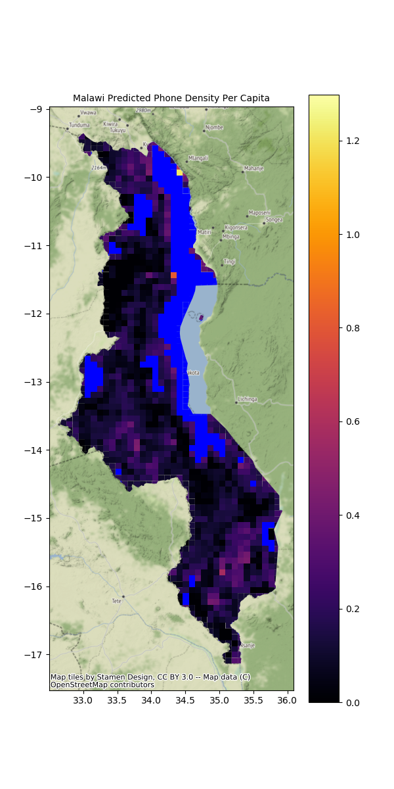

Telecoms Analytics for Demand using Deep Learning (taddle)
===========================================

Description
===========
**taddle** is a predictive codebase for estimating telecoms demand in areas of poor data
availability.

Setup and configuration
=======================

The recommended installation method is to use [conda](http://conda.pydata.org/miniconda.html),
which handles packages and virtual environments,
along with the `conda-forge` channel which has a host of pre-built libraries and packages.

Create a conda environment called `taddle`:

    conda create --name taddle python=3.6 gdal geoio geopandas rasterstats rasterio

Activate the environment by running:

    conda activate taddle

Then run:

    conda install pytorch torchvision -c pytorch

All code for **taddle** is written in Python (Python>=3.6) and has a number of dependencies.
See `requirements.txt` for a full list. Run `pip install -r requirements.txt` to install them.

The core model is a CNN that can be trained using instructions from https://github.com/jmather625/predicting-poverty-replication.

If you run the repository in its entirety, you should obtain the following files/folders
*inside* the `predicting-poverty-replication` repository:
- trained_model.pt (CNN)
- LSMS survey data for Malawi
- 2013 nightlights data
- cluster_feats.npy
- cluster_order.pkl
- api_key.txt

Copy those files/folders to the following locations, relative to root:
- trained_model.pt -> model/trained_model.pt
- LSMS/malawi_2016/ -> data/LSMS/MWI/input/
- Nightlights/2013/ -> data/Nightlights/2013
- api_key.txt -> utils/api_key.txt (root of the repo)

Finally, run `python scripts/create_ridge_models.py` to create the Ridge Regression models
that will predict telecoms demand. You can explore this and other aspects of the code in the
`ipynb` folder.

**Alternatively, you can skip this process and download the files from this GDrive link: https://drive.google.com/drive/folders/1ILbkcckl38tMVYSMm3Oq_VYaOKseuyIp?usp=sharing. Move them to the following locations:**
- trained_model.pt -> models/trained_model.pt
- ridge_consumption.joblib -> models/ridge_consumption.joblib
- ridge_phone_consumption.joblib -> models/ridge_phone_consumption.joblib
- ridge_phone_density.joblib -> models/ridge_phone_density.joblib
- cluster_feats.npy -> data/LSMS/MWI/processed/cluster_feats.npy
- cluster_order.pkl -> data/LSMS/MWI/processed/cluster_order.pkl

You still need to acquire your own *api_key.txt*.

Predicting Telecoms Demand for a Country
========================================

Now that we have trained the models, we can move on to the purpose of this repository -
predicting telecoms demand metrics in data-poor locations with high spatial granularity,
using only satellite imagery.

You will need to download the Global Administrative Database (GADM). Choose the link that lets
you download "six separate layers.":
- https://gadm.org/download_world.html

Move the download into `data/gadm36_levels_shp`.

Also download the global population data from WorldPop and place it in `data/world_population`:
- https://www.worldpop.org/geodata/summary?id=24777.

Next, go into `script_config.ini` and enter in the three digit code for any country you want,
e.g. 'MWI'.

Then run:

    python scripts/preprocess.py
    python scripts/grid.py
    python scripts/download_images.py --generate-download-locations
    python scripts/download_images.py --download-images
    python scripts/model_pipeline.py --extract-features
    python scripts/model_pipeline.py
    python vis/cluster_vis.py
    python vis/grid_vis.py

`preprocess.py` will select the data relevant to your country from the GADM data and world
population data that you downloaded.

`grid.py` will divide the country into small 10km x 10km grids. This can be changed in
`script_config.ini` to any level of granularity.

`download_images.py` will generate 20 download locations within each grid and proceed to
download those images using Google's Static Maps API.

`model_pipeline.py` will pass these images through the model pipeline. This means first
passing the images through the CNN and extracting their features, then averaging those
features within each grid, and then using the Ridge Regression models to predict telecoms
demand metrics for each grid.

`cluster_vis.py` will generate a plot of the observed and predicted values for the country of
choice.

`grid_vis.py` will generate a prediction map for the country for each broadband metric.
An example is shown below:

  

The color blue indicates regions with too few people (under 100) to be considered. This does
not necessarily mean they are bodies of water. They could also be forests, deserts or less
habitable terrain.

Results
=======

- Prediction maps can be found in `results/<YOUR COUNTRY CODE>/results/figures`. In this
repository we've included our results for Malawi in the `figures` folder.
- Other results such as grid-level predictions can be found in `results/<YOUR COUNTRY CODE>/results/`
- Model performances are outlined below

| Model              |  Metric       | Score     |
| ------------------ |:-------------:| :-------: |
| CNN                | accuracy      |   0.69    |
| Phone Consumption  | R^2           |   0.375   |
| Phone Density      | R^2           |   0.503   |
| Consumption        | R^2           |   0.268   |

Runtime Guide
======================
The slowest step will be downloading images (`scripts/download_images.py`). Downloading 20
images for each grid in Malawi leads to a download size of 24,000. This takes about 5 hours.
**We have written the script so that if the download breaks for some reason, you can simply rerun the script and it will only download whatever is left to be downloaded.**

The second slowest step will be passing the images through the CNN for feature extraction
(`scripts/model_pipeline.py`). On a GPU, this should take about 10 minutes for 24,000 images.
On a CPU, that runtime will be around 4 hours. **After this forward pass has completed once, the result is saved to disk and will not have to be undertaken again.**

Background and funding
======================

**taddle** has been funded by UK EPSRC via the Infrastructure Transitions Research
Consortium (EP/N017064/1) and a subsequent EPSRC Impact Accelerator Award.

Contributors
============
- Edward J. Oughton (University of Oxford)
- Jatin Mathur (University of Illinois)

Quick Start
===========
- download:
    - gadm data
    - lsms data
    - worldpop
- run scripts/get_data.py
- run scripts/grid.py
- run scripts/preprocess.py
- run scripts/predict.py
- run vis/vis.py
