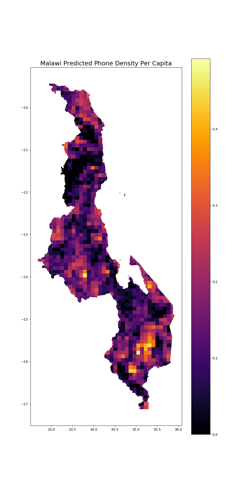

Telecoms Analytics for Demand using Deep Learning (taddle)
===========================================

Description
===========
**taddle** is a predictive codebase for predicting telecom demand in areas of poor data
availability.

Setup and configuration
=======================

The recommended installation method is to use [conda](http://conda.pydata.org/miniconda.html),
which handles packages and virtual environments,
along with the `conda-forge` channel which has a host of pre-built libraries and packages.

Create a conda environment called `taddle`:

    conda create --name taddle python=3.6 gdal geoio geopandas rasterstats

Activate the environment by running:

    conda activate taddle

Then run:

    conda install pytorch torchvision -c pytorch

All code for **taddle** is written in Python (Python>=3.6) and has a number of dependencies.
See `requirements.txt` for a full list. Run `pip install -r requirements.txt` to install them.

We use https://github.com/jmather625/predicting-poverty-replication as a submodule. It contains instructions on downloading data and training the CNN.

    git submodule init
    git submodule update

Navigate to `cnn/predicting-poverty-replication` and follow the ReadMe. This will show you how to train the CNN from scratch and use it to predict `consumption`, a metric for poverty. You should obtain the following files/folders *inside* the predicting-poverty-replication repository.
- trained_model.pt (CNN)
- LSMS/malawi_2016/ (survey data)
- Nightlights/2013/ (nightlights data)
- cluster_feats.npy
- cluster_order.pkl
- api_key.txt

Copy those files/folders to the following locations, relative to root:
- trained_model.pt -> model/trained_model.pt
- LSMS/malawi_2016/ -> LSMS/input/malawi
- Nightlights/2013/ -> LSMS/Nightlights/2013
- api_key.txt -> api_key.txt (root of the repo)

Finally, run `python scripts/create_ridge_models.py` to create the Ridge Regression models that will predict broadband demand. You can explore this and other aspects of the code in the `ipynb` folder.

**Alternatively, you can skip this process and download the files from this GDrive link: https://drive.google.com/drive/folders/1ILbkcckl38tMVYSMm3Oq_VYaOKseuyIp?usp=sharing. Move them to the following locations:**
- trained_model.pt -> model/trained_model.pt
- ridge_consumption.joblib -> model/ridge_consumption.joblib
- ridge_phone_consumption.joblib -> model/ridge_phone_consumption.joblib
- ridge_phone_density.joblib -> model/ridge_phone_density.joblib
- cluster_feats.npy -> cnn/predicting-poverty-replication/cluster_feats.npy
- cluster_order.pkl -> cnn/predicting-poverty-replication/cluster_order.pkl

You still need to acquire your own *api_key.txt*.

Predicting a Country
=======================
As an input, all we need is a shapefile of the country (any country) you wish to predict. Place this shapefile files in the following folder:  `data/<COUNTRY_NAME>/shapefile/`. Modify `script_config.ini` to reflect the country you wish to predict.

Then run:

    python scripts/grid.py
    python scripts/download_images.py --generate-download-locations
    python scripts/download_images.py --download-images
    python scripts/model_pipeline.py --extract-features
    python scripts/model_pipeline.py
    python vis/create_plots.py

`grid.py` will divide the country into small 10km x 10km grids. This can be changed in `script_config.ini` to any level of granularity.

`download_images.py` will generate 20 download locations within each grid and proceed to download those images using Google's Static Maps API.

`model_pipeline.py` will pass these images through the model pipeline. This means first passing the images through the CNN and extracting their features, then average those features within each grid, then use the Ridge Regression models to predict the broadmand demand metrics for each grid.

`create_plots.py` will generate a prediction map for the country for each broadband metric. An example is shown below:

  

Results
======================
- prediction maps can be found in `results/malawi/figures/`
- model performances are outlined below

| Model              |  Metric       | Score     |
| ------------------ |:-------------:| :-------: |
| CNN                | accuracy      |   0.69    |
| Phone Consumption  | R^2           |   0.375   |
| Phone Density      | R^2           |   0.503   |
| Consumption        | R^2           |   0.268   |

Runtime Guide
======================
The slowest step will be downloading images (`scripts/download_images.py`). Downloading 20 images for each grid in Malawi led to a download size of 24,000. This took about 5 hours. **We have written the script so that if the download breaks for some reason, you can simply rerun the script and it will only download whatever is left to be downloaded.**

The second slowest step will be passing the images through the CNN for feature extraction (`scripts/model_pipeline.py`). On a GPU, this should take about 10 minutes for 24,000 images. On a CPU, that runtime will be around 4 hours. **After this forward pass is done once, the result is saved to disk and will not have to be done again.** For some reason, we noticed `tdqm`, the progress bar library, was slowing down the forward pass by a 2x factor sometimes. We have written a replacement a simple progress "bar" for this part of the code, although it is not anything fancy.

Background and funding
======================

**taddle** has been funded by UK EPSRC via the Infrastructure Transitions Research
Consortium (EP/N017064/1) and a subsequent EPSRC Impact Accelerator Award.

Contributors
============
- Edward J. Oughton (University of Oxford)
- Jatin Mathur (University of Illinois)

Quick Start
===========
- download:
    - gadm data
    - lsms data
    - worldpop
- run scripts/get_data.py
- run scripts/grid.py
- run scripts/preprocess.py
- run scripts/predict.py
- run vis/vis.py
