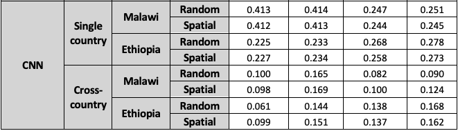

Telecoms Analytics for Demand using Deep Learning (taddle)
===========================================

Description
===========
**taddle** is a predictive codebase for estimating telecoms demand in areas of poor data
availability. We provide the codebase to both recreate the developed models, and demonstrate how to use these models to make spatially granular prediction maps.


Setup and configuration
=======================

We recommend you use [conda](http://conda.pydata.org/miniconda.html) to handle package installation and virtual environments.

Create a conda environment called `taddle`:

    conda create --name taddle python=3.6 gdal geoio geopandas rasterstats rasterio

Activate the environment by running:

    conda activate taddle

Then run:

    conda install pytorch torchvision -c pytorch

All code for **taddle** is written in Python (Python>=3.6) and has a number of dependencies. Run `pip install -r requirements.txt` to install them.

To get the prerequisite data, you need to follow four necessary steps:
1) Get the LSMS survey data from the world bank. Download the 2016-2017 Malawi survey data, 2015-2016 Ethiopia data, and the 2015-2016 Nigeria data from https://microdata.worldbank.org/index.php/catalog/lsms. The World Bank wants to know how people use their data, so you will have to sign in and explain why you want their data. Make sure to download the CSV version. Unzip the downloaded data into `countries/<country name>/LSMS/`. Country name should be either `malawi_2016` or `ethiopia_2015`.
2) Get an api key from either Planet or Google's Static Maps API service. Both of these should be free, but Planet may take some time to approve and require you to list a research project to be eligible for the free tier. Google's service should be free if you download under 100k images per month. Save the api keys to `planet_api_key.txt` or `google_api_key.txt` in the root directory. We used Planet's API because then we could download images from 2015 and 2016, whereas Google's service only offers recent images over the last year. To use Google's API, you'll have to import `GoogleDownloader` instead of `PlanetDownloader` and chnange `ACCESS_TOKEN_DIR` in `scripts/download_cnn_images.py`. You will also need to rewrite a small bit of the download function `download_images` (specifying timerange is no longer needed; after that change it *should* work). Similar changes need to be made to `scripts/download_grid_images.py` (the main download function has the same name).
3) Download the Global Administrative Database (GADM) from https://gadm.org/download_world.html. Choose the link that lets you download "six separate layers" as shapefiles. Extract and move to `data/gadm36_levels_shp`.
4) Download the global population data from https://www.worldpop.org/geodata/summary?id=24777. Move to `data/world_population/ppp_2020_1km_Aggregated.tif`.
5) (optional) Download nightlights data from https://www.ngdc.noaa.gov/eog/viirs/download_dnb_composites.html. Use the 2015 annual composite in the 75N/060W tile and the 00N/060W tile. Save them to viirs_2015_<tile_descriptor>.tif, where tile_descriptor is 75N/060W or 00N/060W. This will be used to create the baseline models that are mentioned in the paper.

Please let us know if any links become broken. Contact info is at the bottom of this document.

Data Preprocessing
=======================
To preprocess the survey data and download the images, run:
```
python scripts/process_survey_data.py
python scripts/download_cnn_images.py
```

Model Training
=======================
To train the CNN and extract features from images, run:
```
scripts/train_cnn.ipynb
scripts/feature_extract.ipynb
```
We left this code in Jupyter Notebook to allow for extra clarity and facilitate code exploration.   

Then, to create the Ridge Regression models that use extracted CNN features to predict our metrics, run:
```
python scripts/train_ridge_models.py
```

All of the files in this section contain three important global variables: TYPE, COUNTRY, and METRIC. TYPE determines whether you are testing single country or cross country models. In the single country case, COUNTRY determines which country is being tested. In the cross country case, COUNTRY determines which country is held out. METRIC determines which of our two metrics, device penetration (called "house_has_cellphone") and monthly phone costs per capita (called "est_monthly_phone_cost_pc"), to train. <strong>Remeber to modify TRAINING_CONFIG in config.py for the desired combination before running those three scripts.</strong>

You can visualize the predictions by running:
```
python vis/cluster_vis.py
```
This creates an observed vs predicted plot with prediction intervals. Prediction intervals use the probabilistic formulation of Ridge Regression. They interpret the prediction of the Ridge Regression model as the mean of a Gaussian. We can find the optimal standard deviation of this Gaussian through some algebra. Note that ensembling five ridge models together does not change the calculation because the ensemble can be expressed as a single ridge model whose weights and regularization coefficient are the average of the five ridge models.


Create Prediction Maps
=======================
Now that we have trained the models, we can prediction maps for our metrics across an entire country.

Set the country code for your country of interest in the `PREDICTION_MAPS_CONFIG` dictionary in `config.py`. Malawi's is MWI, and Ethiopia's is ETH.

Then run:
```
python scripts/extract_shapefile.py
python scripts/create_grids.py
python scripts/download_grid_images.py --generate-download-locations
python scripts/download_grid_images.py --download-images
```
Note: for Ethiopia, we recommend reducing the number of images because Ethiopia has such a large land area. 20 images per 10km x 10km would lead to a download size of 236,000 images.

Set the metric in the `PREDICTION_MAPS_CONFIG` dictionary in `config.py`. The choices are device penetration ("house_has_cellphone") and monthly cost for phone services per capita ("est_monthly_cost_pc").

Then run:
```
python scripts/model_application.py
python vis/grid_vis.py
```

`scripts/extract_shapefile.py` will select the data relevant to your country from the GADM data and world
population data that you downloaded.

`scripts/create_grids.py` will divide the country into small 10km x 10km grids. 10km is arbitrary and can be changed. However, this is the same box size used during model training.

`scripts/download_grid_images.py` will generate 20 download locations within each grid and proceed to download those images using the Planet API.

`scripts/model_application.py` will generate predictions at the grid level. This means passing the images through the CNN and extracting their features, then averaging those
features within each grid, and then using the Ridge Regression models to predict the metric at the grid level.

`scripts/grid_vis.py` will generate a prediction map for the country for each broadband metric.
An example is shown below:

<p align="center">
  </img>
</p>

The color gray indicates regions with too few people (under 100) to be considered. This probably means water, forests, deserts or some other less habitable terrain.

Results
=======
- Model performances are outlined below

<p align="center">
  </img>
</p>

Runtime Guide
======================
The slowest step will be downloading images. Expect it to take several hours per country.
**We have written the script so that if the download breaks for some reason, you can simply rerun the script and it will only download whatever is left to be downloaded.**

The second slowest step will be training the CNN. On a single GPU, this should take a few hours.

Background and funding
======================

**taddle** was part funded by (i) the UK EPSRC via the Infrastructure Transitions Research
Consortium (EP/N017064/1) and (ii) George Mason University.

Contributors
============
- Edward J. Oughton (eoughton@gmu.edu)
- Jatin Mathur (jatinm2@illinois.edu)
